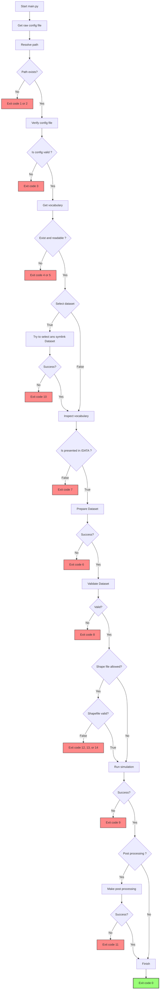

# Dreifa modelēšanas rīks

Konteineris ir paradzēts jūras objektu dreifa simulācijas palaišanai. Projekts ir veidots uz [OpenDrift](https://opendrift.github.io/) **Pyhton** bibliotēkas bāzes. Ka *input* tas pieņiem JSON konfigurācijas failu un datasetus GRIB vai NetCDF formatā. *output* ir datasets ar kustības trajektoriju, kas ir saglabāta NetCDF formatā.

# Projekta struktūra
```
opendrift-container/
│
├── main.py                     # pamata programma
├── src/
│   ├── config_verification.py      # JSON faila validācija un sadalīšana uz simulācijas un datu konfigurācijam
│   ├── case_study_tool.py          # simulācijas funkcijas
│   ├── general_tools.py     		# Rīki, kurus lieto vairāki moduli
│   ├── file_clusterization.py      # Rīks, lai sadalītu falus apakšmapēs atbilstoši unikāliem nosaukumiem failu nosaukumā (lietots iekš dataset_selection.py)
│   ├── post_processing.py     		# gatavas trajektorijas pēcapstrāde
│   └── dataset_tools/
│       ├── dataset_verification.py     # Datasetu validācija. Pārbauda vai ievadītais laiks pārklājās as datu laikiem
│       ├── dataset_selection.py        # Datasetu automatizēta izvelēšana atkarība no pieprasīta laika. 
│       └── dataset_preparation.py      # Ielasa datasetus un sagatavo tos lietojumam simulācijā
│
├── DATA/
│   ├── VariableMapping.json    # Iekšeja vārdnīca priekš korektu parametru nosaukumu ielasīšanās
│   └── colorscale.json			# Krasu skalas līmeņi un hex krāsu kodi, atbilstosi katram līmenim. 
│
├── INPUT/                      
│   └── input_test.json			# fitktīvais konfigurācijas fails priekš conteinera testa
│
├── tests/                     
│   └── test_functions.py		# galveno funkciju testi  
├── pallets/             
│   ├── POC_scale.drawio.png		    # krasu skala POC kartēm
│   └── POC_scale.drawio_dark.png		# ta pati krasu skala tikai tumšas tēmas stilā  
│
├── requirements.txt            # Python nepieciešamas paketes
├── Dockerfile                  # Konteinera iestatījumi
├── .dockerignore               # faili, kurus konteineris ignorēs
├── .gitignore                  # faili, kurus Git ignorēs
└── README.md    
```
# Setup & Usage
- Image izveidošana:

```docker build -t opendrift-container .```

- Konteinera palaišana:

```
docker run \
	-v path/to/host/dataset/folder:/DATASETS \
   	-v path/to/host/config/file.json:/opendrift-container/INPUT/config.json \
	-v path/to/store/results:/OUTPUT \
	opendrift-container python main.py config.json 
``` 
# Workflow design
